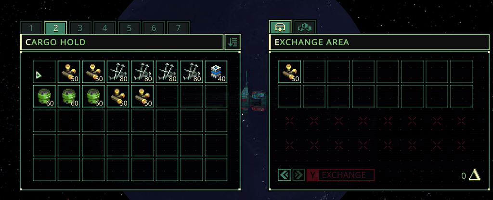

# Quasimorph Mouse Move Transfer




Holding control while moving the mouse over items will cause those items to be moved.
This allows the user to quickly move items without having to click each individual item.

# Configuration

The configuration file will be created on the first game run and can be found at `%AppData%\..\LocalLow\Magnum Scriptum Ltd\Quasimorph_ModConfigs\MouseMoveTransfer\config.json`.

## Disable Sound
By default the transfer sound is disabled, but can be re-enabled to the game's default:


|Name|Default|Description|
|--|--|--|
|DisableMoveSound|true|If true, items transferred will not make a sound|

## Keys and/or Mouse Buttons

The mouse and keys to activate the mouse move are set in the "Keys" area.
A "chord" is one or more keys and/or mouse buttons that have to be held down at the same to to invoke the move.
There can be more than one "chord" configured.

For example, adding the middle mouse button, would be adding a new Chord with Mouse2 as the value.  
Mouse0 is left button, Mouse1 right, etc.

Example of adding middle mouse button:
```json
//...
    "Chords": [
      [
        "Mouse2"
      ],
//Existing entry...
      [
        "LeftControl",
        "Mouse0"
      ],
//...
```

## Key List
The list of valid keyboard keys can be found  at the bottom of https://docs.unity3d.com/ScriptReference/KeyCode.html
Beware that numbers 0-9 are Alpha0 - Alpha9.  Most of the other keys are as expected such as X for X.
Use "None" to not bind the key.


# Buy Me a Coffee
If you enjoy my mods and want to buy me a coffee, check out my [Ko-Fi](https://ko-fi.com/nbkredspy71915) page.
Thanks!

# Source Code
Source code is available on GitHub at https://github.com/NBKRedSpy/QM_MouseMoveTransfer

# Credits

Thanks to Discord users Kashmyrr and Raigir for the mod idea.

# Change Log
## 1.2.0
* Upgraded the activation keys to key chords.
* Added the option to not disable the transfer sound.

## 1.1.0
* Added config for modifier key.
