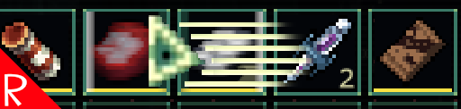

# Quasimorph Mouse Move Transfer

When holding the control key and moving over items in inventory, this mod will move any items that are under the cursor as the user moves the mouse.
This allows the user to quickly move items without having to click each individual item.

# Support
If you enjoy my mods and want to buy me a coffee, check out my [Ko-Fi](https://ko-fi.com/nbkredspy71915) page.
Thanks!

# Source Code
Source code is available on GitHub at https://github.com/NBKRedSpy/QM_MouseMoveTransfer

# Credits

Thanks to Discord users Kashmyrr and Raigir for the mod idea.